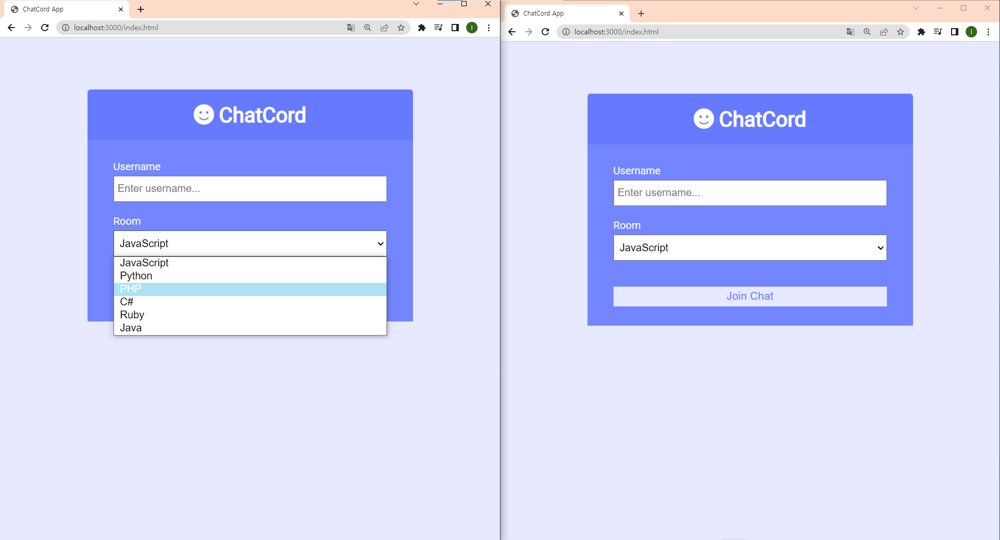
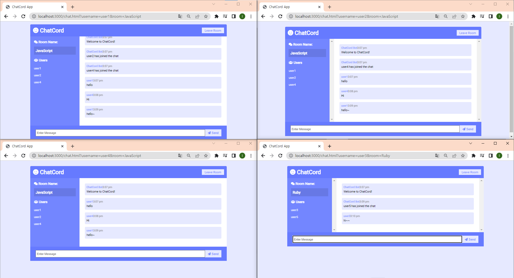

# TraversyMedia_Chatcord

This project is a real-time chat application built using websockets.

## Reference Sites

Click on the links to visit the respective sites.

-   [Link Traversy Media YouTube] https://github.com/bradtraversy/chatcord
-   [Link Traversy Media GitHub] https://www.youtube.com/watch?v=jD7FnbI76Hg

## Tech Stack

List the technologies and tools used in the project:

-   Front-end: HTML, CSS, JavaScript
-   Back-end: Node.js, Express.js, Socket.io

## Installation

```
npm install
npm run dev

http://localhost:3000/
```

## Usage Example

After entering your username and room information, you can start the chat.

[index page]


[chat page]

